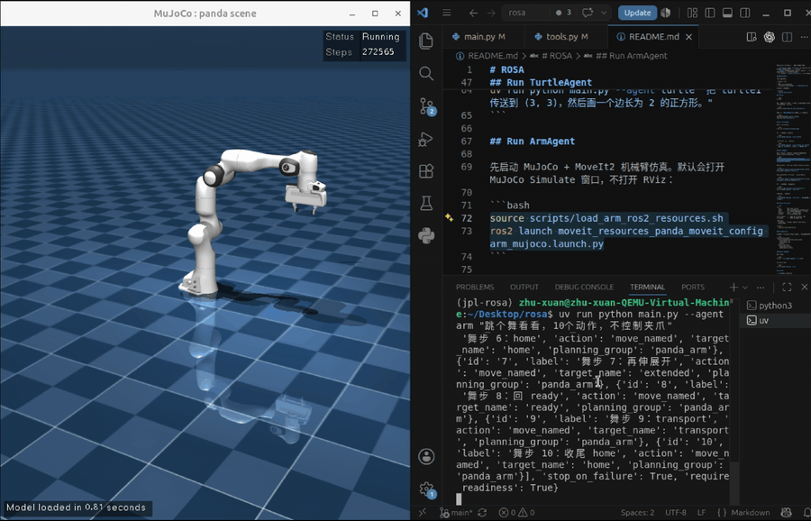

# ROSA

本项目最初 fork 自 [NASA JPL ROSA](https://github.com/nasa-jpl/rosa)，当前版本在原项目基础上改造成
ROS2 + Codex + LangChain v1 的机器人 Agent 框架。

这个仓库当前包含两个基于 ROSA 框架的实现：

- `TurtleAgent`：面向 `turtlesim` 的轻量示例，用来验证 ROS2 工具调用、绘图和多轮对话。
- `ArmAgent`：面向机械臂的实现，当前默认目标是 Franka Emika Panda，使用 MoveIt2 规划，
  使用 MuJoCo / `mujoco_ros2_control` 做仿真可视化，并通过常驻 MoveItPy server 执行 pose goal。

## Demo

ArmAgent 在 MuJoCo 中执行连续机械臂动作：



## Requirements

框架基础依赖：

- Python 3.10+
- `uv`
- ROS2 Jazzy 或 Humble
- 本机已登录 Codex，并存在 `~/.codex/auth.json`

ArmAgent 额外需要：

- MoveIt2
- `mujoco_ros2_control`

## Install

```bash
uv sync
```

运行前需要在当前终端加载 ROS2 环境。ArmAgent 可以直接使用仓库提供的加载脚本：

```bash
source scripts/load_arm_ros2_resources.sh
```

默认使用 `ROS_DISTRO=jazzy`。如果使用 Humble：

```bash
ROS_DISTRO=humble source scripts/load_arm_ros2_resources.sh
```

## Run TurtleAgent

先启动 turtlesim：

```bash
ros2 run turtlesim turtlesim_node
```

另开一个终端启动 agent：

```bash
uv run python main.py --agent turtle
```

也可以直接传入第一条消息：

```bash
uv run python main.py --agent turtle "把 turtle1 传送到 (3, 3)，然后画一个边长为 2 的正方形。"
```

## Run ArmAgent

先启动 MuJoCo + MoveIt2 机械臂仿真。默认会打开 MuJoCo Simulate 窗口，不打开 RViz：

```bash
source scripts/load_arm_ros2_resources.sh
ros2 launch moveit_resources_panda_moveit_config arm_mujoco.launch.py
```

这个 launch 会同时启动 `rosa_arm_moveit_server`。ArmAgent 的 pose goal 会通过
`/rosa_arm_moveit_server/move_pose` 调用常驻 MoveItPy 节点，避免在聊天进程里临时初始化
MoveItPy 时混用 wall time 和 sim time。

如果想同时打开 RViz 查看 MoveIt planning scene：

```bash
ros2 launch moveit_resources_panda_moveit_config arm_mujoco.launch.py rviz:=true
```

如果只想后台运行仿真，不打开 MuJoCo 窗口：

```bash
ros2 launch moveit_resources_panda_moveit_config arm_mujoco.launch.py headless:=true
```

另开一个终端运行 ArmAgent：

```bash
source scripts/load_arm_ros2_resources.sh
uv run python main.py --agent arm
```

直接发送第一条消息：

```bash
uv run python main.py --agent arm "检查机械臂运行栈是否就绪"
```

## Project Structure

```text
src/
  rosa/        ROSA 核心 runtime
  codex/       Codex ChatModel 的 LangChain 适配
  tools/       通用 ROS2、系统、日志和计算工具
  sessions/    本地多轮 session 存储
  prompts/     通用机器人系统 prompt

turtle_agent/  基于 ROSA 的 turtlesim 实现
arm_agent/     基于 ROSA 的机械臂实现

resources/
  arm_agent/   ArmAgent 需要的 Panda MoveIt 和 MuJoCo 资源

scripts/
  load_arm_ros2_resources.sh
```

## Arm Resources

ArmAgent 随仓库提供 Panda 机械臂第一阶段需要的资源：

```text
resources/arm_agent/
  mujoco_menagerie/franka_emika_panda/
    scene_moveit.xml
    panda_moveit.xml
    assets/
  moveit_resources/
    panda_description/
    panda_moveit_config/
```

## Useful Commands

运行测试：

```bash
uv run --with pytest pytest -q -W error
```

查看入口参数：

```bash
uv run python main.py --help
```

## License

见 [LICENSE](LICENSE)。
